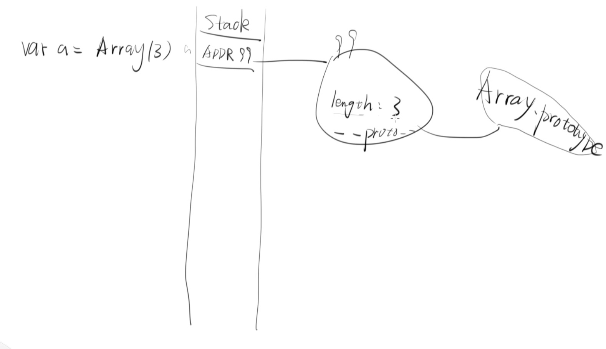

# API ，new 存在与否的影响，和数组的不一致性 

## 1.0API：
什么是API：游览器提供的东西 。<br>
就像是 Object  String Number Boolean Array 等 ，都是API。< br>
因为它们都是游览器提供给用户使用的。<br>

### 1.0.1 Object : 
传入任何参数返回的值都会被Object 包装成一个对象 。<br>
有没有new 返回的值都是对象 。<br>
          
### 1.0.2 String:  
传入的参数返回的值是一个字符串常量 ，<br>
但是 new String （1），<  br>
返回的就是一个对象 。 <br>
所以 有new 的话 就变成 对象 ，<br>
没有new  就是字符串 。<br>

### 1.0.3Number：
传入的参数返回的值是一个数字，<br>
但是new Number（），<  br>
返回的就是一个对象。<br>
所以有new 的话就变成对象，<br>
没有new  就是一个数字 。<br>

### 1.0.4Boolean： 
传入的参数返回的值 不是true 就是 false ，<br>
但是new Boolean ，<  br>
返回的就是一个对象 。<br>
所以有new 的话 就变成 对象 ，<br>
没有new  就不是 true 就是false 。<  br>

### 1.0.5Array：
两种方式返回的值 都是数组， <br>
换一种说法：<br>
申明一个数组以下两种方式都是可以的。 <br>


####  1.0.5.1 Array之构造函数：

#####  1.0.5.1.1传入的参数只有一个，代表：长度;

```

var a = Array(3);
```

生成了一个 长度为3的数组 。<br>
但是为什么a[0] 是undefined ；<br>
0 in a 是false？  <br>
因为a 没有 0 1 2 3。<br>
为什么a 没有 0 1 2 3 ？<br>
完整代码见下图：<br>


原因见图：<br>



如图所示：<br>
变量 a（或者说数组a ）存的不是一个值,而是一个地址 。<br>
地址是随机的，暂定址是99。 在地址99里面 ，为什么会有length 的属性？ <br>
甚至还会有 Array.push 的push 的属性 等？ 这些属性都不是用户自己定义的 <br>
原因是原型的存在。见下图： <br>
数组a 继承了 Array 里面所有的属性或者说 Array构造数组a 。 <br>
 


回到问题： a 为什么没有存下0 1 2 3 这几个key？ <br>
第一：原型里没有； <br>
第二： 用户自己也没有对这个属性进行定义。<br>


#####  1.0.5.1.2 传入的参数有两个，代表：就是正常的数组；

```
var b = Array(3,3);
```


为什么传入的参数个数不一样，结果就不一样？ <br>
Javascript的不一致性，或者说 这是 javascript 不被喜爱的地方之一 。 <br>

### 1.0.6总结一下： 
如果是Javascript 的简单数据类型：number,string,boolean。<br>  
有没有new 这个关键词 ,差别很大. <br>
如果是Javascript 的复杂数据类型：array ，function。 有没有 new 这个关键词 没有差别。<br>
