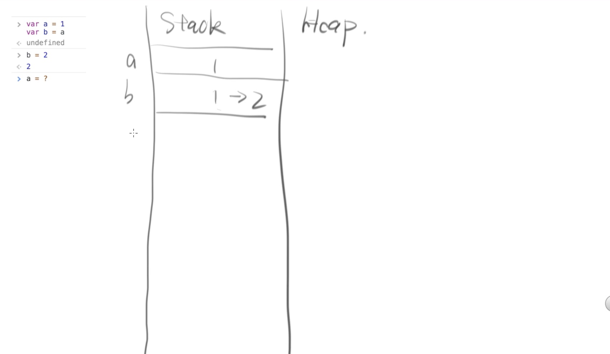
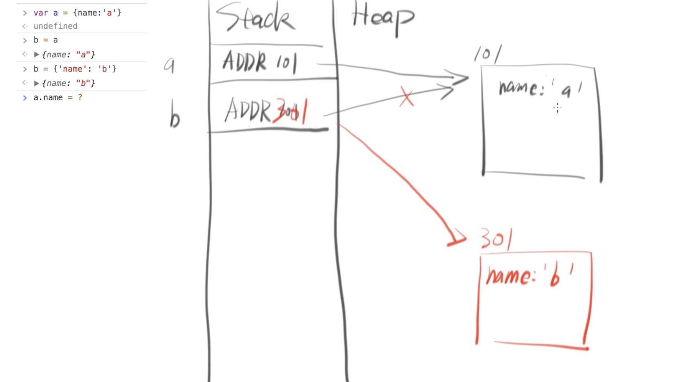
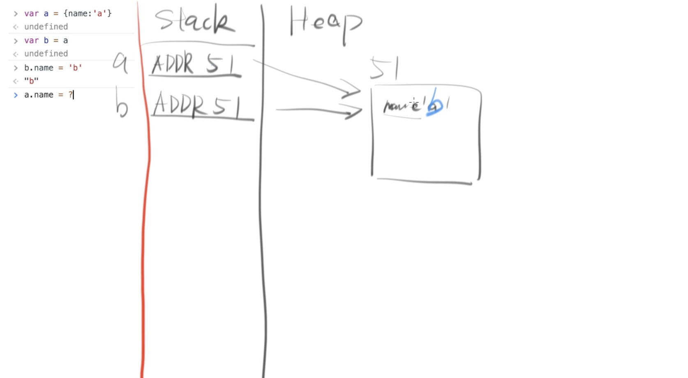
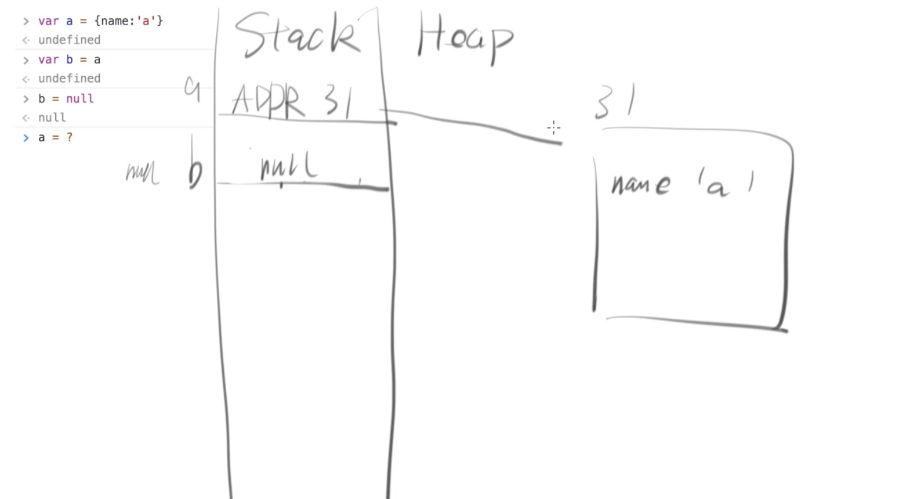
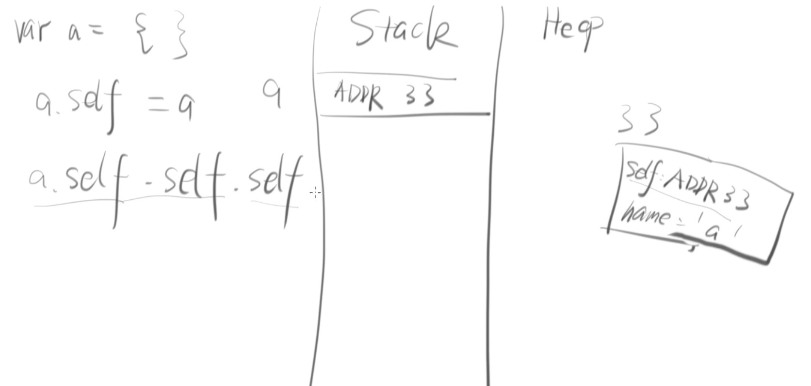
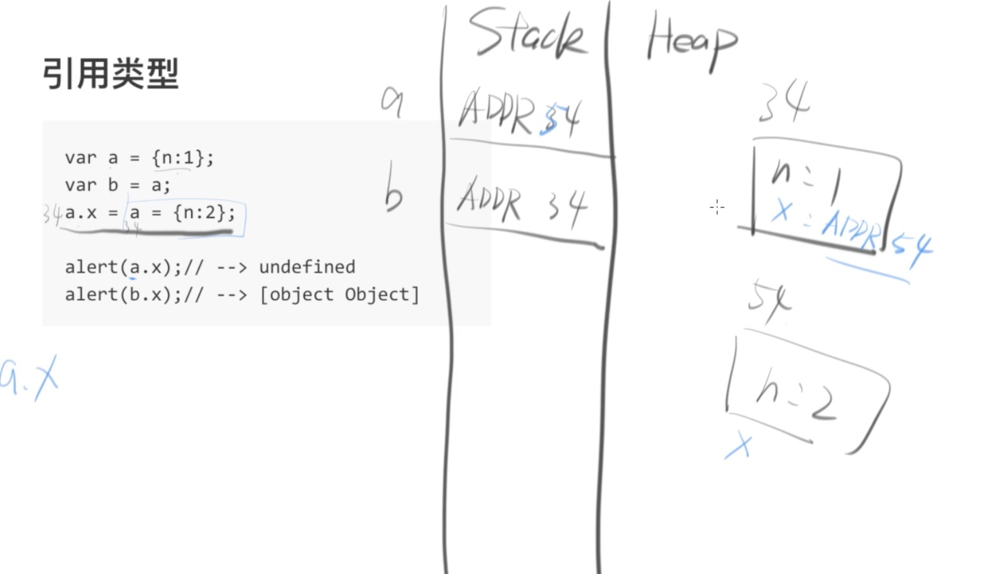
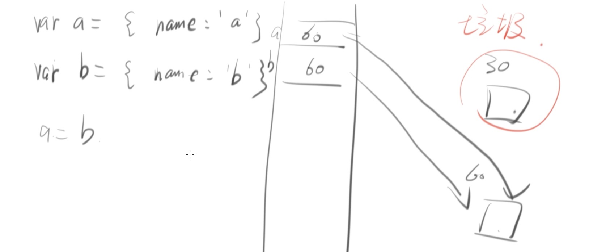

# JavaScript（值）value & （引用）reference 

## 1.0  两种简单的模型  
```
var a=3;
var b=3;
console.log(a===b);
true;

var c = {name:"testObject"}
var d = {name:"testObject"}
console.log(c===d)
false;

// var c 和 d 要绝对相等的话 
var c = {name:"testObject"}
var d = c;
console.log(c===d)
true;
```

上面代码中一个是false  一个是 true？可是赋值都是一样的呀<br>
why?<br>
涉及到的概念 ：<br>
计算机是怎么存储人类写的代码的 <br>

```
var a = 1；
```

以上代码 是不会直接被计算机执行的 会被计算机先编译一次 <br>
编译之后的代码  计算机懂 最后被计算机执行 <br>
为了简化复杂的计算机存储数据概念 <br>  
有两种模型可以使用：<br>


### 1.0.1第一种：（画图）
Stack  heap<br>
哪些值放入stack ：简单的值： number null  undefined <br>
string  boolean symbol 互相拷贝的话  仅仅就是值(value)  <br>
哪些值放入heap  复杂的值：像是object 相互拷贝的话 就不是传递值(value) 而是(reference) 引用对方的地址  <br> 
一句话就是  **存对方的地址** <br>
function 和array  也是属于object <br>

```
// 例题一 
var a =1；
var b =a;
b=2;
a;  
```



```
//第二个例题
var a = {name: 'a'};
b=a;
b={name:'b'};
a.name;// 'a'
```




```
// 第三个例题
var a = {name:'a'}
var b = a;
b.name = 'b';
a.name// 'b'
```





```
// 第四个例题
 var a = {name:'a'}
 var b =a;
 b = null;
 a; // {name:'a'};
```





### 1.0.2第二种   （画表格）

与第一种方法相比， 第二种方法需要一个前提： 假设  地址 是一个新的数据type，就像是string number 一样 primitive type。 

```
var a = {name: 'a'};
b=a;
b={name:'b'};
a.name;// 'a'
```
 
variable      value              address              object
- - - -
a                  <#330>           #330                {name:’a’}
- - - -
B                  <#330>          #330                 {name:’a’} (会被游览器回收 ）
- - - -
                   <#331>          #331                 {name:’b’}


## 1.1 循环引用 
```
var a ={}; 
a.self = a;
a.self.self.self;
```

⚠️：地址是随机的哦 



```
var a={self:a};
a.self// undefined
// 上面的代码等同于下面的代码 

var a ; // a = undefined 
a ={self:a}
a;//{self: undefined} 

```


## 1.2一道容易让人走入“歧途”的题目

```
var a = {n:1}
var b = a;
a.x = a ={n:2}// “一句话办了两件事” 这样的代码容易让人晕呀 
alert(a.x)// undefined 
//答案就在 上一行代码那里：
// 不能用正常的思维去思考：
//a ={n:2}；
// a.x = a；
// 如果是这样想的 全错；
// 按照这样的代码思考；
var a ={n:1};
var b =a;
a.x;// undefiend 
a.x=a={x:2};
a;//{n:2}
alert(a.x)// undefined 
alert(b.x)// [object object] b所存数据的位置还是ADD 34
因此在ADD 34里面去看b.x 存的是一个object  因为alert会 字符化 最后的答案是[object object]

```





## 1.3 垃圾回收 
如果一个对象没有被引用， 它就是垃圾。将会被♻️。
```
var a ={name: 'a'};
var b ={name: 'b'};
a=b;
console.log(a);// {name: "b"}
// 原来的那一个 a ={name: 'a'} 去哪里了？
// 被游览器回收了
// 什么时候被♻️的？
// 没有被（第三方，自己，或者另外的）引用的时候。
```





## 1.4  内存泄漏
应该被标记为垃圾的但是由于游览器的bug，内存就会被永久的占用。 解决方法： 就是所有的应该被回收的 直接设置为 null。

```
var fn =function(){}
document.body.onclick = fn;
var fn =null;
// 场景： 此时 页面还没有被关闭 fn 被 document 调用所以不是垃圾
// 页面关闭 如果是IE6的话 就不会把fn 当成垃圾
// 解决方法
window.onunload = function(){
document.body.onclick = null;
}
```


## 1.5深拷贝&浅拷贝
什么是深拷贝：
  b 变不影响 a；
```
var a = 1；
var b = a；
b =2；
a =1；
```

什么是 浅拷贝：
  b 变影响 a;
```
var a ={
name: 'a'
}
var b = a;
b.name ='b'
a.name// 'b'

```
