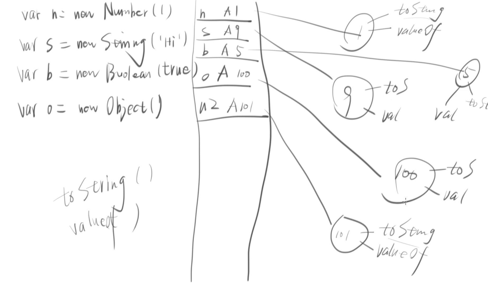
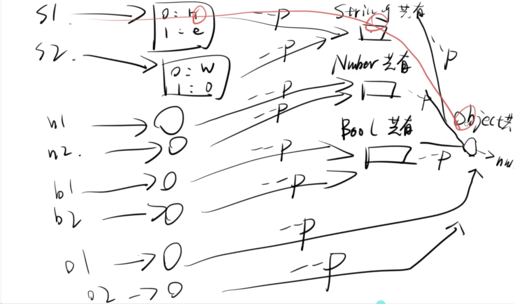
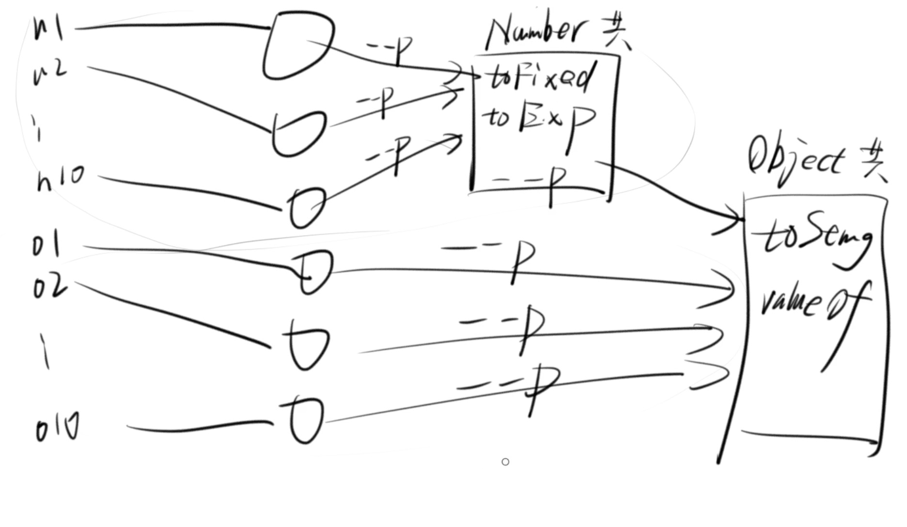

# 原型和原形链 


## 1.0为什么会出现原型？




每一个 Number String Boolean 等 Object 都有或者对象标配都应该toString value of 等方法。<br>
如果没有一个指定的地方去存放这些标配里面应该有的方法，那么每次创建一个新的object，当这个object需要调用 toString valueof的时候<br>
他会自己去创建这两个方法然后再去调用。<br>

这种方法在只有一个object的时候不会出现问题，不过当有10000个object的时候，每一个object都去自己制作自己用，object当然是可以接受。<br> 
同时不必要的内存就浪费了。<br>

解决的方法：指定一个地方去存放那些常用的方法。<br> 
这些被放在指定地方的方法的名字：**共用属性**。<br>
它还有另外一个名字:原型 (prototype)<br>   
那对象的共有属性 用代码怎么表示？ Object.prototype;<br>
这样当这些方法被需要使用的时候 就可以直接调用它们了。<br>  

怎么调用这些方法？ 用 __ proto __  。<br>


**原形链了怎么还没有出现？**<br>


见下图：
只需要关注 S1 对就是有红色那条线的S1。 <br>
当 S1 需要调用一个方法时，先去 String 共有属性（结点里面找有没有这个方法<br>
没有 没事 接着找再去Object的共有属性（结点）里面找终于找到了。 <br>
在寻找这个方法的过程，就是原形链形成的过程。 <br>




## 2.0结果一样， 过程就一样吗？ 
用图（树型图）来解答：<br>



用代码来说：<br>

```
var n1 = new Number();
n1.toString;
var n2 =  new object();
n2.toString;

```

虽然最后答案都是一样的 但是n1 和 n2 的toString 不是一样的 因为n1 是 一<br>个数字的对象 n2 就是一个普通的对象 <br>


## 3.0 _proto_  和 prototype 分不清 还？


还是上面的那张图：<br>
还是关注 S1  就是有红色那条线的S1；<br>

### 3.1 第一种看图说话:
o1 需要去调用（或者去继承） 数字原型 里面的 方法时，就用 下划线 proto 下划线 。 <br>
如果数字原型里面有 那么这个式子  o1._proto_ === String.prototype 就是成立的。<br>
如果数字原型里面没有？ 那就去对象原型 里面找 。<br>
如果对象原型有  那么这个式子<br>
o1._proto_._proto_  ===  Object.prototype; 就是成立的 <br>
如果还是没有了？<br>
那就是undefined了。<br>
```
var o1 = new String();
o1._proto_ === String.prototype 
true;
o1._proto_._proto_  ===  Object.prototype;
true;

```

###  3.2第二种用证明法 来证明 ：
