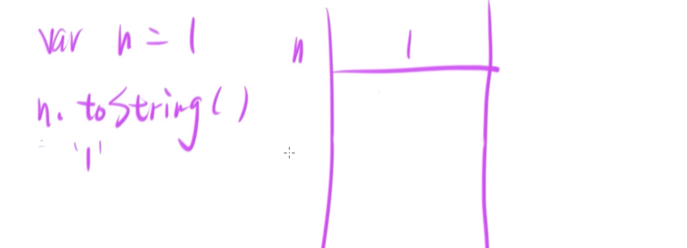
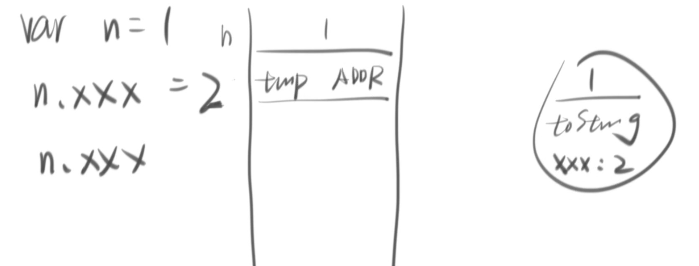
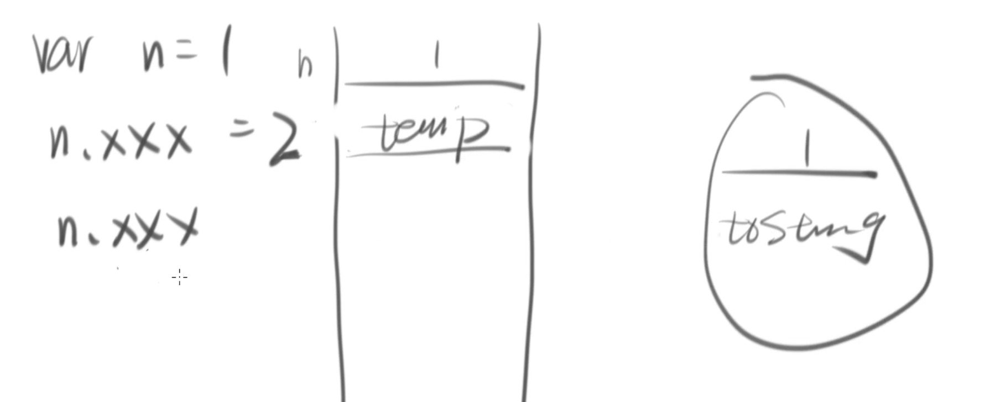

#  对象 还有差别吗？
有的  

## 1.0 名字 ：
ECMAScript 规定全局函数叫做 ：   global   
在游览器里全局对象有专有名字：   **window**  

## 2.0 类别 ：
也分两种：
ECMA Script 规定的  例如

```
global.parseInt
global.parseFloat
global.Number

```

游览器独有的属性： 

```
// 弹框提示
window.alert("hi");
//用户填写
a=window.prompt("填写")
//确认
window.confirm("确认")
//填写 
window.console.log('hi');
// document (dom)
window.document
```


## 3.0一个简单的数字 都可以有property 但是简单的数字又不是对象 怎么可能 ？
 
当然可以了。

```
//两种方式声明一个简单的数字 
var n = 1;// 1 是 简单数字
var v = new Number(1);// 1 是一个对象 
```

如果是一个对象的话 就可以使用很多游览器自带的API ie： toString等

可是
```
var n = 1；
n.toString();
"1";
```

为什么一个简单的数字 都可以用toString 游览器内置API toString？

因为  有临时对象产生    请看图 


**临时对象的使命完成之后，就自动被游览器当成垃圾收走了。所以，临时对象存活的时间取决于n.tostring什么时候被游览器执行完**

临时对象 被收走之后  请看图 一点痕迹都没有留下 


 
 var n = new Number()  这个语法就很少被人使用 
因为已经有一个简单的方法  可以用所有的 只有复杂对象 才能用的 属性 

例题：

```
var n = 1；
n.xxx = 2;
console.log(n.xxx)//undefined； 
```

画图解题：



 



## 4.0一个简单的字符串也可以有property吗？
当然可以了 。
again。 因为有临时内存。 

```
// 两种方式 声明字符串 
var test = “test”；//一个简单的字符串
var s2 = new String(test);// 字符串是对象 
test[0];// "t"
s2[0];//"t"
```


## 5.0 关于false 这个对象 
只有5个falsey 值：
0 NaN “” null undefined 
基于此 所有的对象都是 truey。 
即使是 false 这个的对象  也是对象 
```
var f = false；
var f2 = new Boolean(false);
if(f){console.log(1);}
if(f2){console.log(2);} 
// 2 

```


## 6.0声明对象的两种方式 结果一样 就一样吗？
不一样 。

```
var  o1 = {};
var  o2 = new object{};
console.log(o1===o2);
//false;
```
