# Javascript 数组
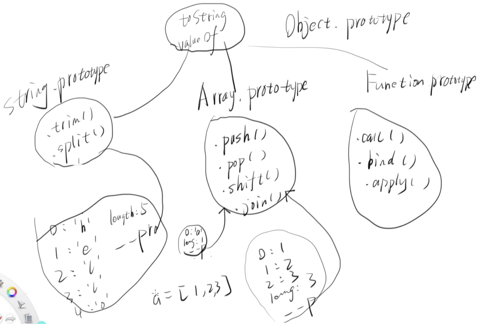
**配图和主题有关 请关注中间Array.prototype 那一列** 


## 1.0  什么是数组？
人是怎么理解？<br>
数组是按次序排列的一组值。 <br>
重要吗？<br>
不重要。 <br>
重要的是:<br>
Javascript自己是怎么定义和理解数组的：<br>
Array 是由Array 构造出来的一个对象，是一种拥有数组原型或者说特殊原型链的对象。


## 2.0对象 和 一种特殊的对象（数组）有什么差别？
对象没有数组原型或者说 只有数组才能继承数组原型。<br>
更近一步说，数组还能继承对象原型。<br>
但是反过来的话，就不可以了。<br>

看代码：<br>
如果obj 这个对象 可以继承数组的原型的话，那为什么obj.push 还要报错？<br>
反而是数组a 不仅可以调用method push ，还可以调用 method toString 。 <br>
所以 数组是特殊的一种对象 。<br>
 
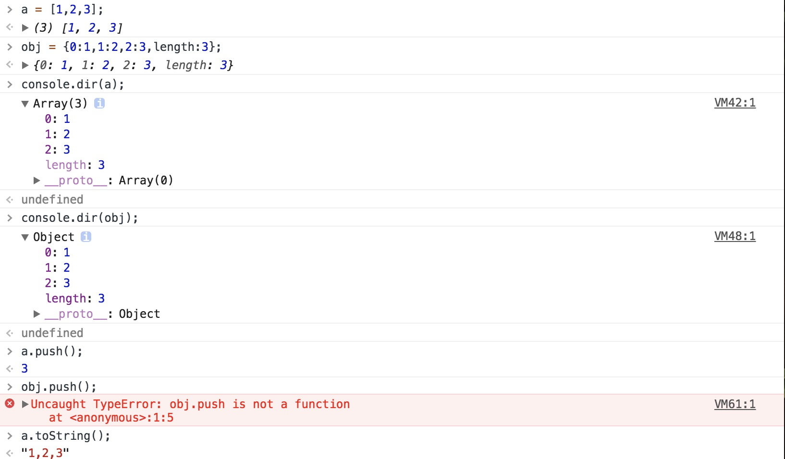

看图：<br>
和代码相比较，更加清晰；<br>

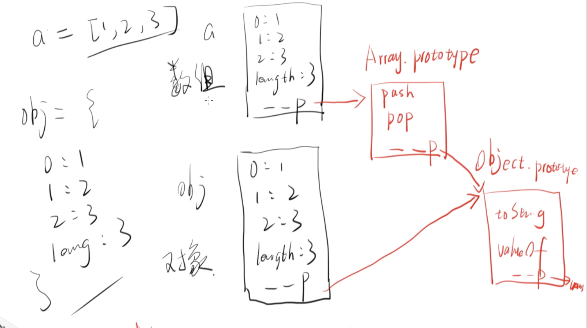

## 3.0 关于Array 的几个重要API  
### 3.0.1 forIn 和for 的”谜之“差别

For loop 只遍历了有数字的key而跳过不是数字的key。<br>
因为循环的启始条件是从0 开始；控制循环的条件是： i++；<br>
所以for loop 在遍历数组的时候，只遍历是有数字的key。<br>

For  in 把数组当成对象来遍历，结果：只要是key的，都可以遍历。<br>
换一种说法：<br>
For in 决定了这个变量是不是对象。<br>

画外音： 什么是key ？ 有一种数据结构叫做hash。 而构造成hash的有两个部分： key 和 value。  <br>

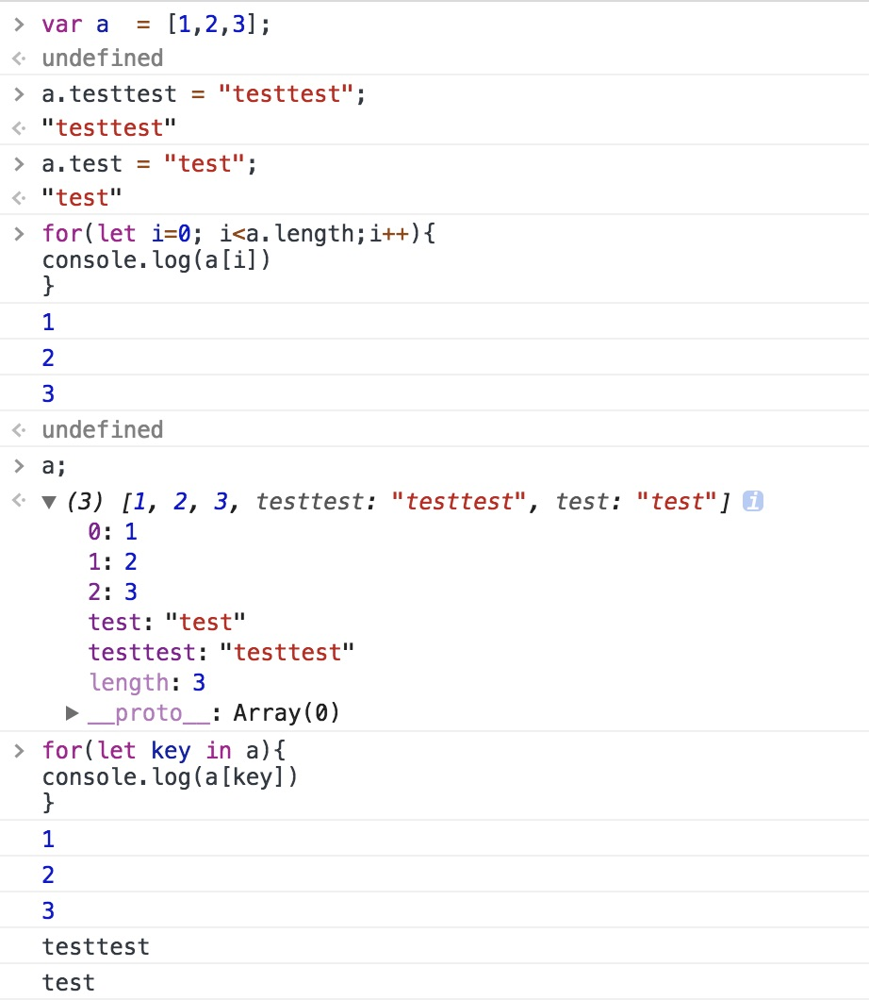

那如果一定要用for loop 来遍历一个对象，应该怎么做？<br>
请确保所有的key 都是数字。<br>

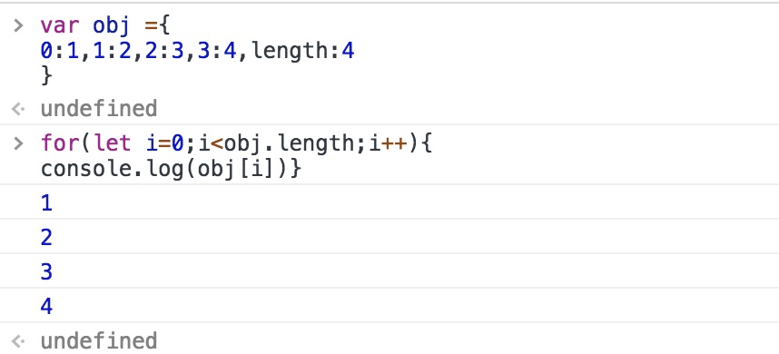

### 3.0.2 forEach  
特别之处： <br>
forEach 这个API  可以接受函数作为参数 并且执行和传参数给<br>
这个被当作参数的函数;<br>
问题：<br>
 a.forEach 被游览器执行时， 这个数组a是什么时候被传入forEach中的？<br>
答案： 是传的两个参数  代码等价于 <br>
```
a.forEach(function(){})
a.forEach.call(a,function(){}) 
中间的“桥梁”： this；
```


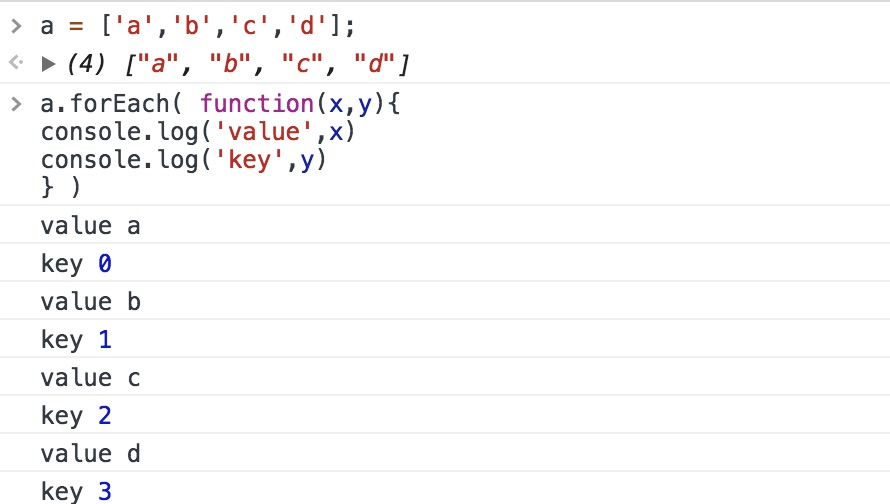

### 3.0.3 join 
数组变字符串 <br>

```
var a = [0,1,2];
a.join(",");
a.join();// 如果是传参是空的，就默认为逗号
```


### 3.0.4 concat 

```
var a = [1,2,3]
var b = [4,5,6]
a.concat(b);// 生成了一个新数组，不改变原来的数组
var b = a.concat([]);// 看起来是复制数组a 但是cancat总是返回一个新数组
a === b;// false 
var b = a;
a === b;// true 
```

### 3.0.5map
 Map 和 forEach 很相似，唯一的不同：<br>
ForEach 运行结束以后，不会返回任何值；<br>
Map运行结束以后，会返回值，并把返回值做成一个新数组。<br>

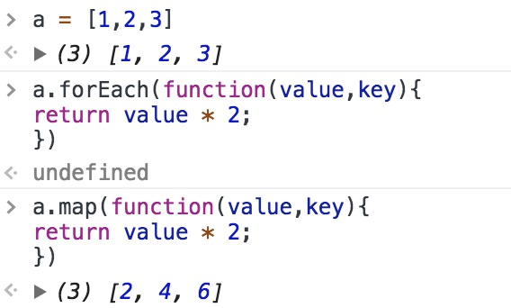


### 3.0.6filter 
自定义数组被筛选条件。<br>
不改变原有的数组，返回一个新数组。<br>

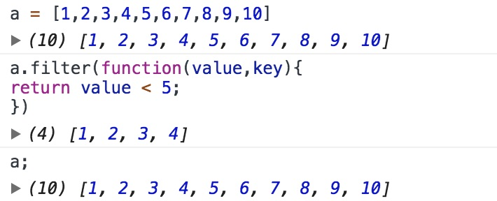

升级版：<br>


### 3.0.7reduce
字面上的意思： 减少 ;<br>
事实上： 整体减少到一个<br>
下面的例子是求和：

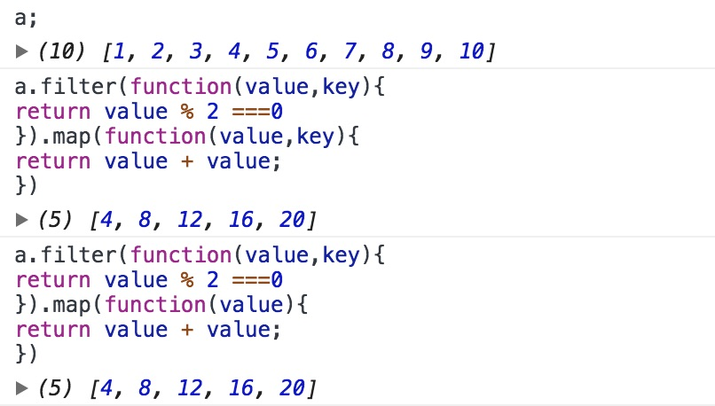

下面两个例子，可以用reduce 来分别实现： map and filter。

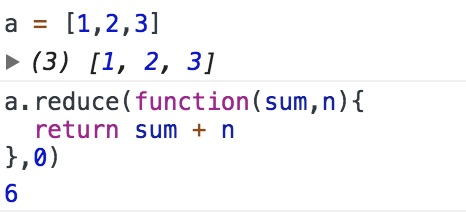


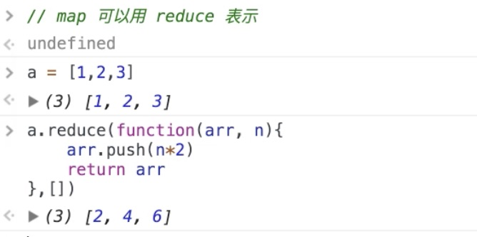


## 4.0伪数组 
### 4.0.1 什么是伪数组 
如果数组最终没有继承Array prototype 的属性 ，那么就是伪数组。<br>

### 4.0.2什么情况下是伪数组？
Obj 和arguments 就是伪数组；<br>


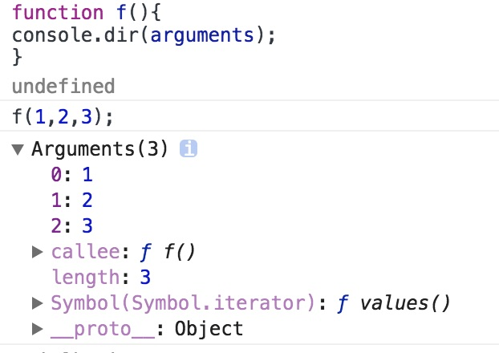


